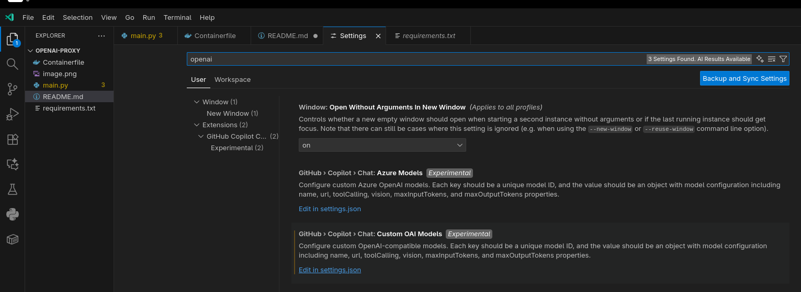
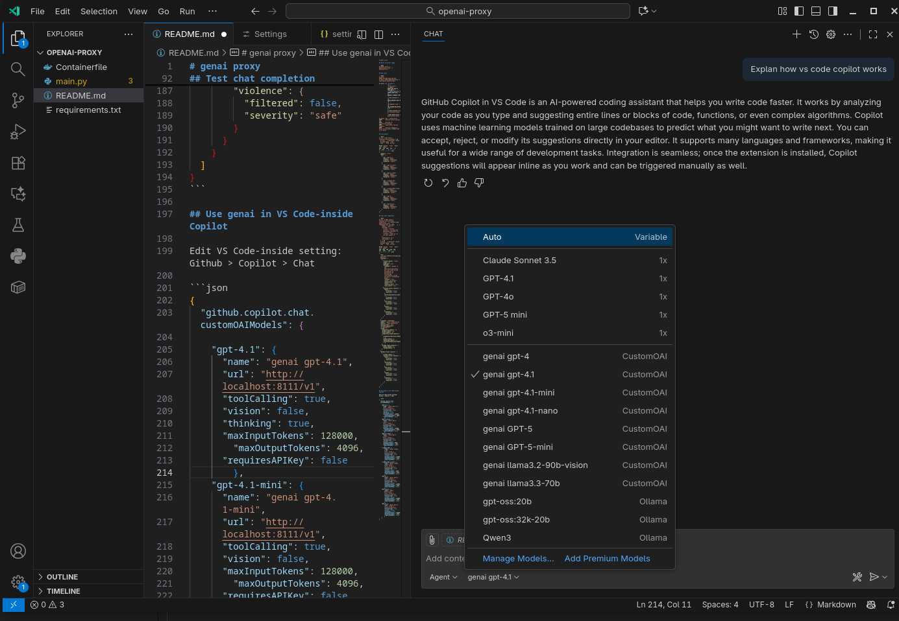

# genai proxy

OpenAI compatible proxy

## Overview and Functionality

This project provides an OpenAI-compatible HTTP proxy that injects a corporate subscription header with an API key and forwards requests to a configured upstream OpenAI compatible endpoint. It provides extensive logging and error handling and it normalizes certain request fields for the “gpt-5” family, supports Server-Sent Events (SSE) streaming passthrough, and offers detailed request/response logging with retry logic.

### Architecture


### Endpoints

| Method | Path                | Behavior |
|--------|---------------------|----------|
| GET    | `/`                 | Returns proxy metadata (name, version, upstream).
| GET    | `/health`           | Probes `GENAI_BASE_URL/`; returns text or 502 on error.
| GET    | `/v1/health`        | Forwards to upstream `/v1/health`.
| GET    | `/v1/models`        | Local static OpenAI-compatible model list (no upstream call).
| POST   | `/v1/chat/completions` | Forwards to upstream with optional SSE stream passthrough; normalizes payload for `gpt-5`.

### How it works (request flow)

- Parses incoming request and body, generates/request-carries `X-Request-ID`.
- Builds forward headers, injecting the subscription header: name=`GENAI_SUBSCRIPTION_NAME`, value=`GENAI_API_KEY`.
- Redacts sensitive headers from logs (authorization, proxy-authorization, and the subscription header name).
- Normalizes `/v1/chat/completions` for `gpt-5*` models:
  - Converts `max_tokens` to `max_completion_tokens`.
  - Defaults `max_completion_tokens` to 128000 if `max_tokens` or `max_completion_tokens` is missing.
  - Sets `temperature` to 1 (`temperature` less then 1 is not supported for gpt-5).
  - Adds `Accept: text/event-stream` if `stream=true`.
- Performs the upstream request using `httpx.AsyncClient`.
- For streaming, passes bytes through while optionally logging a preview of the first N bytes.
- Returns non-stream responses with `X-Upstream-Status` and `X-Request-ID` headers.

### Configuration

| Variable | Default | Purpose |
|---|---|---|
| `GENAI_SUBSCRIPTION_NAME` | (required) | HTTP header name used to send the API key (subscription).
| `GENAI_API_KEY` | (required) | Subscription key value placed in the above header.
| `GENAI_BASE_URL` | (required) | Upstream base URL (e.g., `https://gateway.apiportal.genai.nl/genai`).
| `REQUEST_TIMEOUT` | `60` | Per-request timeout (seconds).
| `MAX_RETRIES` | `2` | Number of retry attempts on retryable errors.
| `RETRY_BACKOFF_SEC` | `0.5` | Base backoff; actual backoff = base × 2^attempt.
| `LOG_BODIES` | `true` | If true, logs request/response bodies (JSON or raw preview).
| `ALLOWED_ORIGINS` | `` | Comma-separated origins to allow via CORS (if set, CORS is enabled).
| `LOG_STREAM_MAX_BYTES` | `0` | If >0, logs up to N bytes of streamed chunks.

### CORS

- Enabled only if `ALLOWED_ORIGINS` is set (comma-separated list).
- Allows all methods and headers; credentials allowed.

### Logging

| Event | Level | Fields |
|---|---|---|
| Startup config | INFO | `SUBSCRIPTION_NAME` (name), masked key (first 4 chars + asterisks), `GENAI_BASE_URL`, `REQUEST_TIMEOUT`, `MAX_RETRIES`, `RETRY_BACKOFF_SEC`, `LOG_BODIES`, `ALLOWED_ORIGINS`, `LOG_STREAM_MAX_BYTES`.
| Request | INFO | `id`, `method`, `path`, `upstream`, redacted `headers`, `body` (if `LOG_BODIES`).
| Response (JSON) | INFO | `id`, `status`, `duration_ms`, redacted `headers`, `body` (if `LOG_BODIES`).
| Response (non-JSON) | INFO | `id`, `status`, `duration_ms`, redacted `headers`, `body_length` and `content_type` (if `LOG_BODIES`).
| Streaming start | INFO | `id`, `status`, `duration_ms`, redacted `headers`, `streaming=true`.
| Streaming chunk | INFO | `id`, `bytes`, `preview` (up to `LOG_STREAM_MAX_BYTES`).
| Retry | WARNING | `id`, `retry` number, `backoff_sec`, `error` type/message.
| Final error | ERROR | `{ error: { type: "proxy_error", message, request_id, upstream } }`.

### Error handling

| Condition | Retry? | Result |
|---|---|---|
| `httpx.ConnectError` | Yes (up to `MAX_RETRIES`) | Exponential backoff, then `502` with `proxy_error` JSON.
| `httpx.ReadTimeout` | Yes | Same as above.
| `httpx.RemoteProtocolError` | Yes | Same as above.
| `httpx.RequestError` (other) | No | Immediate `502` with `proxy_error` JSON.
| Upstream non-200 | No special handling | Passthrough status/body; adds `X-Upstream-Status`, `X-Request-ID`.

### Response headers

- Non-stream responses include `X-Upstream-Status` and `X-Request-ID`.
- Stream responses include `X-Request-ID` and mirror `Content-Type` (defaults to `text/event-stream; charset=utf-8`).

### Sequence diagram (text)

```
Client -> Proxy: HTTP request
Proxy -> Proxy: Log request, redact sensitive headers
Proxy -> Proxy: Normalize payload (if model starts with gpt-5)
Proxy -> Upstream: Forward request via httpx
Upstream -> Proxy: JSON or SSE stream
Proxy -> Proxy: Log response (and stream chunks preview if enabled)
Proxy -> Client: Return response (+ X-Request-ID, X-Upstream-Status when applicable)
```

## Build container image

```bash
$ podman build -t genai-proxy:latest -f Containerfile .
```

## Run proxy

```bash
$ export GENAI_SUBSCRIPTION_NAME=some-subscription-name
$ export GENAI_API_KEY=some-api-key
$ export GENAI_BASE_URL=https://gateway.apiportal.genai.nl/genai

$ podman run --replace \
             -d \
             -p 8111:8111 \
             -e GENAI_SUBSCRIPTION_NAME="${GENAI_SUBSCRIPTION_NAME}" \
             -e GENAI_API_KEY="${GENAI_API_KEY}" \
             -e GENAI_BASE_URL="${GENAI_BASE_URL}" \
             -e REQUEST_TIMEOUT="60" \
             -e MAX_RETRIES="2" \
             -e RETRY_BACKOFF_SEC="0.5" \
             -e LOG_BODIES="true" \
             -e LOG_STREAM_MAX_BYTES="0" \
             -e ALLOWED_ORIGINS="http://127.0.0.1:8111" \
             --name genai-proxy \
             genai-proxy:latest

$ podman logs -f genai-proxy
2025-10-03 07:20:12,683 INFO SUBSCRIPTION_NAME=*******************
2025-10-03 07:20:12,683 INFO SUBSCRIPTION_KEY=711b*******************
2025-10-03 07:20:12,683 INFO GENAI_BASE_URL=https://gateway.apiportal.genai.nl/genai
2025-10-03 07:20:12,683 INFO REQUEST_TIMEOUT=60.0
2025-10-03 07:20:12,683 INFO MAX_RETRIES=2
2025-10-03 07:20:12,683 INFO RETRY_BACKOFF_SEC=0.5
2025-10-03 07:20:12,683 INFO LOG_BODIES=True
2025-10-03 07:20:12,683 INFO ALLOWED_ORIGINS=['http://127.0.0.1:8111']
2025-10-03 07:20:12,683 INFO LOG_STREAM_MAX_BYTES=0
INFO:     Started server process [1]
INFO:     Waiting for application startup.
INFO:     Application startup complete.
INFO:     Uvicorn running on http://0.0.0.0:8111 (Press CTRL+C to quit)
```

## Run as a systemd Service

Create a file `/etc/systemd/system/genai-proxy.service` with the following content:

```ini
[Unit]
Description=GenAI Proxy Container
After=network.target

[Service]
Restart=always
Environment=GENAI_SUBSCRIPTION_NAME=some-subscription-name
Environment=GENAI_API_KEY=some-api-key
Environment=GENAI_BASE_URL=https://gateway.apiportal.genai.nl/genai
ExecStart=/usr/bin/podman run --replace \
   -p 8111:8111 \
   -e GENAI_SUBSCRIPTION_NAME=${GENAI_SUBSCRIPTION_NAME} \
   -e GENAI_API_KEY=${GENAI_API_KEY} \
   -e GENAI_BASE_URL=${GENAI_BASE_URL} \
   -e REQUEST_TIMEOUT=60 \
   -e MAX_RETRIES=2 \
   -e RETRY_BACKOFF_SEC=0.5 \
   -e LOG_BODIES=true \
   -e LOG_STREAM_MAX_BYTES=0 \
   -e ALLOWED_ORIGINS=http://127.0.0.1:8111 \
   --name genai-proxy \
   genai-proxy:latest
ExecStop=/usr/bin/podman stop -t 10 genai-proxy
ExecStopPost=/usr/bin/podman rm genai-proxy

[Install]
WantedBy=multi-user.target
```

**Usage:**
1. Adjust the `Environment` variables.
2. Reload systemd:  
  `sudo systemctl daemon-reload`
3. Start the service:  
  `sudo systemctl start genai-proxy`
4. (Optional) Enable on boot:  
  `sudo systemctl enable genai-proxy`

## List models

```bash
$ curl -X GET http://127.0.0.1:8111/v1/models | jq
  % Total    % Received % Xferd  Average Speed   Time    Time     Time  Current
                                 Dload  Upload   Total   Spent    Left  Speed
100   570  100   570    0     0   309k      0 --:--:-- --:--:-- --:--:--  556k
{
  "object": "list",
  "data": [
    {
      "id": "gpt-4.1",
      "object": "model",
      "created": 1759432253,
      "owned_by": "genai"
    },
    {
      "id": "gpt-4.1-mini",
      "object": "model",
      "created": 1759432253,
      "owned_by": "genai"
    },
    {
      "id": "gpt-4.1-nano",
      "object": "model",
      "created": 1759432253,
      "owned_by": "genai"
    },
    {
      "id": "llama33_70b",
      "object": "model",
      "created": 1759432253,
      "owned_by": "genai"
    },
    {
      "id": "llama32_90b_vision",
      "object": "model",
      "created": 1759432253,
      "owned_by": "genai"
    },
    {
      "id": "gpt-5",
      "object": "model",
      "created": 1759432253,
      "owned_by": "genai"
    },
    {
      "id": "gpt-5-mini",
      "object": "model",
      "created": 1759432253,
      "owned_by": "genai"
    }
  ]
}
```

## Test chat completion using gpt-4.1

```bash
$ curl -X POST http://127.0.0.1:8111/v1/chat/completions   -H "Content-Type: application/json"   -H "X-Request-ID: test-001"   -d '{
    "model": "gpt-4.1",
    "messages": [
      {"role": "system", "content": "You are a helpful assistant."},
      {"role": "user", "content": "Give me one sentence about OpenAI."}
    ],
    "temperature": 0.2,
    "max_tokens": 64
  }' | jq
  % Total    % Received % Xferd  Average Speed   Time    Time     Time  Current
                                 Dload  Upload   Total   Spent    Left  Speed
100  1609  100  1368  100   241   1932    340 --:--:-- --:--:-- --:--:--  2275
{
  "id": "chatcmpl-CMJ8PmvTwtTGTC8mcvURjHA67tytf",
  "choices": [
    {
      "finish_reason": "stop",
      "index": 0,
      "logprobs": null,
      "message": {
  "content": "OpenAI is a research organization focused on developing and promoting artificial intelligence in a safe and responsible way.",
        "refusal": null,
        "role": "assistant",
        "annotations": [],
        "audio": null,
        "function_call": null,
        "tool_calls": null
      },
      "content_filter_results": {
        "hate": {
          "filtered": false,
          "severity": "safe"
        },
        "protected_material_text": {
          "filtered": false,
          "detected": false
        },
        "self_harm": {
          "filtered": false,
          "severity": "safe"
        },
        "sexual": {
          "filtered": false,
          "severity": "safe"
        },
        "violence": {
          "filtered": false,
          "severity": "safe"
        }
      }
    }
  ],
  "created": 1759432805,
  "model": "gpt-4.1-2025-04-14",
  "object": "chat.completion",
  "service_tier": null,
  "system_fingerprint": "fp_9ab7d013ff",
  "usage": {
    "completion_tokens": 31,
    "prompt_tokens": 28,
    "total_tokens": 59,
    "completion_tokens_details": {
      "accepted_prediction_tokens": 0,
      "audio_tokens": 0,
      "reasoning_tokens": 0,
      "rejected_prediction_tokens": 0
    },
    "prompt_tokens_details": {
      "audio_tokens": 0,
      "cached_tokens": 0
    }
  },
  "prompt_filter_results": [
    {
      "prompt_index": 0,
      "content_filter_results": {
        "hate": {
          "filtered": false,
          "severity": "safe"
        },
        "jailbreak": {
          "filtered": false,
          "detected": false
        },
        "self_harm": {
          "filtered": false,
          "severity": "safe"
        },
        "sexual": {
          "filtered": false,
          "severity": "safe"
        },
        "violence": {
          "filtered": false,
          "severity": "safe"
        }
      }
    }
  ]
}
```

## test chat completion using gpt-5

```bash
$ curl -X POST http://127.0.0.1:8111/v1/chat/completions   -H "Content-Type: application/json"   -H "X-Request-ID: test-001"   -d '{
    "model": "gpt-5",
    "messages": [
      {"role": "system", "content": "you are a python develper."},
      {"role": "user", "content": "write a simple script in python to test the chat completion openai-compatible endpoint http://127.0.0.1:8111/v1/chat/completions (model gpt-5, no api_key needed)."}
    ],
    "max_completion_tokens": 4000
  }' | jq -r '.choices[0].message.content' 
  % Total    % Received % Xferd  Average Speed   Time    Time     Time  Current
                                 Dload  Upload   Total   Spent    Left  Speed
100  4482  100  4129  100   353    322     27  0:00:13  0:00:12  0:00:01  1154
#!/usr/bin/env python3
import argparse
import json
import sys
import requests


def chat(prompt, url="http://127.0.0.1:8111/v1/chat/completions", model="gpt-5", stream=False):
    payload = {
        "model": model,
        "messages": [{"role": "user", "content": prompt}],
    }
    if stream:
        payload["stream"] = True

    headers = {"Content-Type": "application/json"}

    try:
        resp = requests.post(url, headers=headers, data=json.dumps(payload), timeout=60, stream=stream)
    except requests.RequestException as e:
        print(f"Request error: {e}", file=sys.stderr)
        sys.exit(1)

    if not stream:
        if resp.status_code != 200:
            print(f"HTTP {resp.status_code}: {resp.text}", file=sys.stderr)
            sys.exit(1)
        try:
            data = resp.json()
        except json.JSONDecodeError:
            print("Failed to parse JSON response", file=sys.stderr)
            sys.exit(1)
        content = data.get("choices", [{}])[0].get("message", {}).get("content")
        if content is None:
            content = data.get("choices", [{}])[0].get("text")
        print(content if content is not None else data)
        return

    # Streaming mode
    if resp.status_code != 200:
        print(f"HTTP {resp.status_code}: {resp.text}", file=sys.stderr)
        sys.exit(1)

    for line in resp.iter_lines(decode_unicode=True):
        if not line:
            continue
        if line.startswith("data: "):
            payload = line[len("data: "):].strip()
            if payload == "[DONE]":
                break
            try:
                event = json.loads(payload)
            except Exception:
                continue
            choice = event.get("choices", [{}])[0]
            delta = choice.get("delta", {})
            chunk = delta.get("content")
            if chunk is None:
                msg = choice.get("message", {})
                chunk = msg.get("content")
            if chunk:
                print(chunk, end="", flush=True)
    print()


def main():
    ap = argparse.ArgumentParser(description="Test OpenAI-compatible chat completions endpoint")
    ap.add_argument("prompt", nargs="*", help="User prompt to send")
    ap.add_argument("--url", default="http://127.0.0.1:8111/v1/chat/completions", help="Endpoint URL")
    ap.add_argument("--model", default="gpt-5", help="Model name")
    ap.add_argument("--stream", action="store_true", help="Use streaming responses")
    args = ap.parse_args()

    prompt = " ".join(args.prompt) if args.prompt else "Say hello in one short sentence."
    chat(prompt, url=args.url, model=args.model, stream=args.stream)


if __name__ == "__main__":
    main()
```

## Use genai models in VSCode Copilot

note: The OpenAI-compatible provider for copilot is available in VSCode(-insiders) 1.105.0 and above. 

Edit VSCode(-insiders) settings to add the genai models: **Github > Copilot > Chat**



```json
{
  "github.copilot.chat.customOAIModels": {

    "gpt_4": {
        "name": "genai gpt-4",
        "url": "http://127.0.0.1:8111/v1",
        "toolCalling": true,
        "vision": false,
        "thinking": true,
        "maxInputTokens": 128000,
        "maxOutputTokens": 4096,
        "requiresAPIKey": false
        },
    "gpt-4.1": {
      "name": "genai gpt-4.1",
      "url": "http://127.0.0.1:8111/v1",
      "toolCalling": true,
      "vision": false,
      "thinking": true,
      "maxInputTokens": 128000,
        "maxOutputTokens": 4096,
      "requiresAPIKey": false
        },
    "gpt-4.1-mini": {
      "name": "genai gpt-4.1-mini",
      "url": "http://127.0.0.1:8111/v1",
      "toolCalling": true,
      "vision": false,
      "maxInputTokens": 128000,
        "maxOutputTokens": 4096,
      "requiresAPIKey": false
        },
    "gpt-4.1-nano": {
      "name": "genai gpt-4.1-nano",
      "url": "http://127.0.0.1:8111/v1",
      "toolCalling": true,
      "vision": false,
      "maxInputTokens": 4096,
      "maxOutputTokens": 1024,
      "requiresAPIKey": false
        },
    "llama33_70b": {
        "name": "genai llama3.3-70b",
        "url": "http://127.0.0.1:8111/v1",
        "toolCalling": true,
        "vision": false,
        "maxInputTokens": 128000,
        "maxOutputTokens": 4096,
        "requiresAPIKey": false
        },
    "llama32_90b_vision": {
        "name": "genai llama3.2-90b-vision",
        "url": "http://127.0.0.1:8111/v1",
        "toolCalling": true,
        "vision": true,
        "maxInputTokens": 4096,
        "maxOutputTokens": 1024,
        "requiresAPIKey": false
        },
    "gpt-5": {
        "name": "genai gpt-5",
        "url": "http://127.0.0.1:8111/v1",
        "toolCalling": true,
        "vision": false,
        "maxInputTokens": 128000,
        "maxOutputTokens": 4096,
        "requiresAPIKey": false
        },
    "gpt-5-mini": {
        "name": "genai gpt-5-mini",
        "url": "http://127.0.0.1:8111/v1",
        "toolCalling": true,
        "vision": false,
        "maxInputTokens": 128000,
        "maxOutputTokens": 4096,
        "requiresAPIKey": false
        }
    }
}
```

The genai models are available in copilot **model** the drop down menu:

