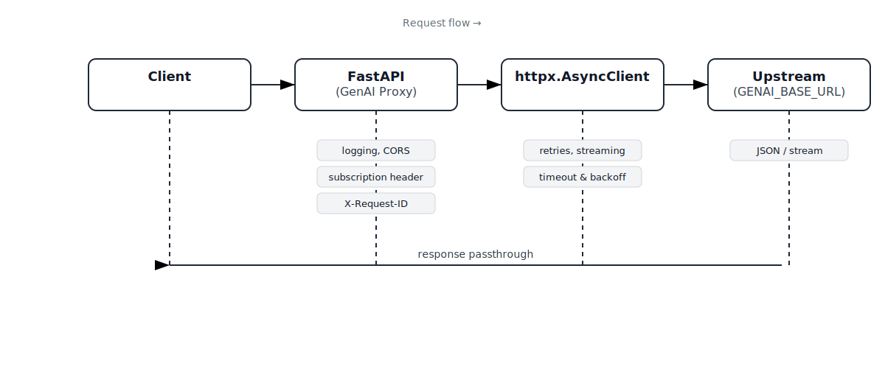

# genai proxy

OpenAI compatible proxy

## Overview and Functionality

This project provides an OpenAI-compatible HTTP proxy that injects a corporate subscription header with an API key and forwards requests to a configured upstream OpenAI compatible endpoint. It provides extensive logging and error handling and it normalizes certain request fields for the “gpt-5” family, supports Server-Sent Events (SSE) streaming passthrough, and offers detailed request/response logging with retry logic.

Clients that can be used with this proxy:
- [VSCode Copilot](https://code.visualstudio.com/insiders/)
- Codex
- Open WebUI
- Open Code

The proxy can be used for OpenAI-compatible API's like:
- [Azure OpenAI](https://learn.microsoft.com/en-us/azure/ai-foundry/foundry-models/concepts/models-sold-directly-by-azure)
- [Ollama](https://github.com/ollama/ollama)

### Architecture




### Endpoints

| Method | Path                | Behavior |
|--------|---------------------|----------|
| GET    | `/`                 | Returns proxy metadata (name, version, upstream).
| GET    | `/health`           | Probes `GENAI_BASE_URL/`; returns text or 502 on error.
| GET    | `/v1/health`        | Forwards to upstream `/v1/health`.
| GET    | `/v1/models`        | Local OpenAI-compatible model list sourced from `models.yaml` (no upstream call).
| POST   | `/v1/chat/completions` | Forwards to upstream with optional SSE stream passthrough; normalizes payload for `gpt-5`.

### How it works (request flow)


### Configuration

| Variable | Default | Purpose |
|---|---|---|
| `GENAI_SUBSCRIPTION_NAME` | (required) | HTTP header name used to send the API key (subscription).
| `GENAI_API_KEY` | (required) | Subscription key value placed in the above header.
| `GENAI_BASE_URL` | (required) | Upstream base URL (e.g., `https://gateway.apiportal.genai.nl/genai`).
| `REQUEST_TIMEOUT` | `60` | Per-request timeout (seconds).
| `MAX_RETRIES` | `2` | Number of retry attempts on retryable errors.
| `RETRY_BACKOFF_SEC` | `0.5` | Base backoff; actual backoff = base × 2^attempt.
| `LOG_BODIES` | `true` | If true, logs request/response bodies (JSON or raw preview).
| `ALLOWED_ORIGINS` | `` | Comma-separated origins to allow via CORS (if set, CORS is enabled).
| `LOG_STREAM_MAX_BYTES` | `0` | If >0, logs up to N bytes of streamed chunks.
| `HTTPS_PROXY` | `` | Optional corporate HTTP/HTTPS proxy URL (e.g., `http://proxy.domain.org:8080`). Authentication is not supported.
| `AUTH_TOKEN` | `` | Optional bearer token required for all requests except `/health` and `/v1/health`. If set, clients must send `Authorization: Bearer <token>`.

#### Corporate proxy (HTTPS_PROXY)

If your environment requires outbound traffic to go through a corporate proxy, set `HTTPS_PROXY` to a valid HTTP or HTTPS URL (e.g., `http://proxy.domain.org:8080`).

- No proxy authentication is supported; do not include credentials in the URL.
- When set, the proxy applies to all upstream calls and streaming.
- Invalid or unreachable proxies will result in `proxy_error` responses; see logs for details.

Example with Podman/Docker:

```bash
podman run -e HTTPS_PROXY="http://proxy.domain.org:8080" \
           -e GENAI_SUBSCRIPTION_NAME="$GENAI_SUBSCRIPTION_NAME" \
           -e GENAI_API_KEY="$GENAI_API_KEY" \
           -e GENAI_BASE_URL="$GENAI_BASE_URL" \
           -p 127.0.0.1:8111:8111 \
           -v "$PWD/models.yaml:/app/models.yaml:z" \
           --name genai-proxy \
           genai-proxy:latest
```

Startup logs include the proxy status and address:

```
INFO HTTPS_PROXY=http://proxy.domain.org:8080
INFO PROXY_ENABLED=True
```

### CORS

- Enabled only if `ALLOWED_ORIGINS` is set (comma-separated list).
- Allows all methods and headers; credentials allowed.

### Logging

| Event | Level | Fields |
|---|---|---|
| Startup config | INFO | `SUBSCRIPTION_NAME` (name), masked key (first 4 chars + asterisks), `GENAI_BASE_URL`, `REQUEST_TIMEOUT`, `MAX_RETRIES`, `RETRY_BACKOFF_SEC`, `LOG_BODIES`, `ALLOWED_ORIGINS`, `LOG_STREAM_MAX_BYTES`.
| Request | INFO | `id`, `method`, `path`, `upstream`, redacted `headers`, `body` (if `LOG_BODIES`).
| Response (JSON) | INFO | `id`, `status`, `duration_ms`, redacted `headers`, `body` (if `LOG_BODIES`).
| Response (non-JSON) | INFO | `id`, `status`, `duration_ms`, redacted `headers`, `body_length` and `content_type` (if `LOG_BODIES`).
| Streaming start | INFO | `id`, `status`, `duration_ms`, redacted `headers`, `streaming=true`.
| Streaming chunk | INFO | `id`, `bytes`, `preview` (up to `LOG_STREAM_MAX_BYTES`).
| Retry | WARNING | `id`, `retry` number, `backoff_sec`, `error` type/message.
| Final error | ERROR | `{ error: { type: "proxy_error", message, request_id, upstream } }`.

### Error handling

| Condition | Retry? | Result |
|---|---|---|
| `httpx.ConnectError` | Yes (up to `MAX_RETRIES`) | Exponential backoff, then `502` with `proxy_error` JSON.
| `httpx.ReadTimeout` | Yes | Same as above.
| `httpx.RemoteProtocolError` | Yes | Same as above.
| `httpx.RequestError` (other) | No | Immediate `502` with `proxy_error` JSON.
| Upstream non-200 | No special handling | Passthrough status/body; adds `X-Upstream-Status`, `X-Request-ID`.

### Response headers

- Non-stream responses include `X-Upstream-Status` and `X-Request-ID`.
- Stream responses include `X-Request-ID` and mirror `Content-Type` (defaults to `text/event-stream; charset=utf-8`).

### Sequence diagram


## Build & Run instructions

Clone this repo in your home directory and follow one of the instructions below:

* Build & Run (rootless)
* Build & Run as a systemd Service

```bash
$ git clone https://github.com/tedsluis/genai-proxy.git
$ cd genai-proxy
```

### Podman or Docker

**Podman** and **Docker** are largely interchangeable for most use cases: both follow OCI standards and share image formats, registries, volume semantics, and networking, so typical workflows are compatible. Unlike Docker, Podman is daemonless—it runs containers directly as regular processes (well-suited to rootless operation) without a central background service. So whenever you see **podman** in this instruction you can also use **docker**.

### Build & Run (rootless)

```bash
$ podman build -t genai-proxy:latest -f Containerfile .

$ export GENAI_SUBSCRIPTION_NAME=some-subscription-name
$ export GENAI_API_KEY=some-api-key
$ export GENAI_BASE_URL=https://gateway.apiportal.genai.nl/genai

$ podman run --replace \
             -d \
             -p 127.0.0.1:8111:8111 \
             -v "$PWD/models.yaml:/app/models.yaml:z" \
             -e HTTPS_PROXY="http://proxy.domain.org:8080" \
             -e GENAI_SUBSCRIPTION_NAME="${GENAI_SUBSCRIPTION_NAME}" \
             -e GENAI_API_KEY="${GENAI_API_KEY}" \
             -e GENAI_BASE_URL="${GENAI_BASE_URL}" \
             -e REQUEST_TIMEOUT="60" \
             -e MAX_RETRIES="2" \
             -e RETRY_BACKOFF_SEC="0.5" \
             -e LOG_BODIES="true" \
             -e LOG_STREAM_MAX_BYTES="0" \
             -e ALLOWED_ORIGINS="http://127.0.0.1:8111" \
             --name genai-proxy \
             genai-proxy:latest

$ podman logs -f genai-proxy
2025-10-22 07:55:01,649 INFO SUBSCRIPTION_NAME=O******************
2025-10-22 07:55:01,649 INFO SUBSCRIPTION_KEY=711b*******************
2025-10-22 07:55:01,649 INFO GENAI_BASE_URL=https://gateway.apiportal.ns.nl/genai
2025-10-22 07:55:01,649 INFO REQUEST_TIMEOUT=60.0
2025-10-22 07:55:01,649 INFO MAX_RETRIES=2
2025-10-22 07:55:01,649 INFO RETRY_BACKOFF_SEC=0.5
2025-10-22 07:55:01,649 INFO LOG_BODIES=True
2025-10-22 07:55:01,649 INFO ALLOWED_ORIGINS=['http://127.0.0.1:8111']
2025-10-22 07:55:01,649 INFO LOG_STREAM_MAX_BYTES=0
2025-10-22 07:55:01,649 INFO HTTPS_PROXY=http://vip-dso-proxy.hopp.ns.nl:8080
2025-10-22 07:55:01,649 INFO PROXY_ENABLED=True
INFO:     Started server process [1]
INFO:     Waiting for application startup.
INFO:     Application startup complete.
INFO:     Uvicorn running on http://0.0.0.0:8111 (Press CTRL+C to quit)

```
note: the HTTPS_PROXY is optional, in case you need to use a corporate internet proxy.

## Run as a systemd Service

On a Linux system you can run genai-proxy as a systemd Daemon. Create a file `/etc/systemd/system/genai-proxy.service` with the following content:

```ini
[Unit]
Description=GenAI Proxy Container
After=network.target

[Service]
Restart=always
Environment=GENAI_SUBSCRIPTION_NAME=some-subscription-name
Environment=GENAI_API_KEY=some-api-key
Environment=GENAI_BASE_URL=https://gateway.apiportal.genai.nl/genai
ExecStart=/usr/bin/podman run --replace \
   -p 127.0.0.1:8111:8111 \
  -v "/opt/genai-proxy/models.yaml:/app/models.yaml:z" \
   -e HTTPS_PROXY=${HTTPS_PROXY} \
   -e GENAI_SUBSCRIPTION_NAME=${GENAI_SUBSCRIPTION_NAME} \
   -e GENAI_API_KEY=${GENAI_API_KEY} \
   -e GENAI_BASE_URL=${GENAI_BASE_URL} \
   -e REQUEST_TIMEOUT=60 \
   -e MAX_RETRIES=2 \
   -e RETRY_BACKOFF_SEC=0.5 \
   -e LOG_BODIES=true \
   -e LOG_STREAM_MAX_BYTES=0 \
   -e ALLOWED_ORIGINS=http://127.0.0.1:8111 \
   --name genai-proxy \
   genai-proxy:latest
ExecStop=/usr/bin/podman stop -t 10 genai-proxy
ExecStopPost=/usr/bin/podman rm genai-proxy

[Install]
WantedBy=multi-user.target
```
note: the HTTPS_PROXY is optional, in case you need to use a corporate internet proxy.

**Usage:**
1. Create genai-proxy.service and adjust the `Environment` variables.
  `sudo vi /etc/systemd/system/genai-proxy.service`
2. Reload systemd:
  `sudo systemctl daemon-reload`
3. Create models.yaml
  `sudo mkdir -p /opt/genai-proxy && sudo vi /opt/genai-proxy/models.yaml`
4. Build container image
  `sudo podman build -t genai-proxy:latest -f Containerfile .`
5. Start the service:
  `sudo systemctl start genai-proxy`
6. (Optional) Enable on boot:
  `sudo systemctl enable genai-proxy`

## Install using the install.sh

```bash
$ ./install.sh 
genai-proxy installer
==> Preparing directories
==> Installing systemd service
Service already exists at /etc/systemd/system/genai-proxy.service; not copying again.
==> Installing models.yaml
==> Building container image (root storage)
[1/2] STEP 1/5: FROM python:3.12-slim AS builder
[1/2] STEP 2/5: WORKDIR /app
--> Using cache e0f0242a0b5543f998749d8f9e0a12af66b4dfc2c0fd82fa77c1f6796571370c
--> e0f0242a0b55
[1/2] STEP 3/5: RUN pip install --upgrade pip wheel
--> Using cache 62e46f78ce2507150e8d181545f8a7bbaeb528a11e7fe1d174fde353e2127d4e
--> 62e46f78ce25
[1/2] STEP 4/5: COPY requirements.txt .
--> Using cache d5383899d564edc4e5b31d91117601c53d1ea7068f9fa5fb5c7cd7f398375bcb
--> d5383899d564
[1/2] STEP 5/5: RUN pip wheel --no-cache-dir --wheel-dir /wheels -r requirements.txt
--> Using cache e353b465b07bbd8dac850b7c5176c43a9f0cabdda7d4dbef754a1c2a1f5bf0cc
--> e353b465b07b
[2/2] STEP 1/10: FROM python:3.12-slim
[2/2] STEP 2/10: ENV PYTHONDONTWRITEBYTECODE=1     PYTHONUNBUFFERED=1     GENAI_SUBSCRIPTION_NAME=some-subscription-name     GENAI_API_KEY=some-api-key     GENAI_BASE_URL="https://genai.example.com"     REQUEST_TIMEOUT="60"     MAX_RETRIES="2"     RETRY_BACKOFF_SEC="0.5"     LOG_BODIES="true"     LOG_STREAM_MAX_BYTES="0"     ALLOWED_ORIGINS=""
--> Using cache ef54f8e492ba27b68ffde5e3cbe96de7dd1a53575cc066f03a14ccb4e4849ccb
--> ef54f8e492ba
[2/2] STEP 3/10: WORKDIR /app
--> Using cache 0795c6debc35c63f32e860ed8782cdb556a3b901e3c0ce9387d1d0aeca0634c2
--> 0795c6debc35
[2/2] STEP 4/10: COPY --from=builder /wheels /wheels
--> Using cache b01e99fd0aa600b00a8ad44a27ce53b0cf9881aebf47b26e11535a82490c3f05
--> b01e99fd0aa6
[2/2] STEP 5/10: RUN pip install --no-cache-dir /wheels/*
--> Using cache a0ab7455645b538307e425b8203a7a964541e84c85ea3d24609204e80613563f
--> a0ab7455645b
[2/2] STEP 6/10: COPY main.py .
--> Using cache 4707b1a5fe58a7ce4319b187698b0ae86fd674bb3473ddb6647c9d24eddf6a79
--> 4707b1a5fe58
[2/2] STEP 7/10: RUN useradd -u 10001 appuser
--> Using cache 8ba748793f2e951f482e500ef7a156bdafdecfc7c40e433aecc5a090d9ca5f1f
--> 8ba748793f2e
[2/2] STEP 8/10: USER appuser
--> Using cache 11a831046a90884092a2bffcf8b08712af6c9da33e15e208703e07a4d0ce70db
--> 11a831046a90
[2/2] STEP 9/10: EXPOSE 8111
--> Using cache 29d8aaafadefebd7bd9109e4f10ef5660ae1ab009fbea6d68a4d085da6dabd8f
--> 29d8aaafadef
[2/2] STEP 10/10: CMD ["uvicorn", "main:app", "--host", "0.0.0.0", "--port", "8111", "--proxy-headers"]
--> Using cache 3de3e07a5f0c88f97d70be4d8255343cb8efadccdf574f470b7bfd8c35dfc6f9
[2/2] COMMIT genai-proxy:latest
--> 3de3e07a5f0c
Successfully tagged localhost/genai-proxy:latest
3de3e07a5f0c88f97d70be4d8255343cb8efadccdf574f470b7bfd8c35dfc6f9
==> Reloading systemd, enabling and starting genai-proxy
==> Done
● genai-proxy.service - GenAI Proxy Container
     Loaded: loaded (/etc/systemd/system/genai-proxy.service; enabled; preset: disabled)
    Drop-In: /usr/lib/systemd/system/service.d
             └─10-timeout-abort.conf
     Active: active (running) since Tue 2025-10-28 13:17:47 CET; 102ms ago
 Invocation: 77e5e6e0c21244dd954c08e9dc78e21a
   Main PID: 540585 (podman)
      Tasks: 22 (limit: 76501)
     Memory: 20.4M (peak: 21.6M)
        CPU: 93ms
     CGroup: /system.slice/genai-proxy.service
             ├─540585 /usr/bin/podman run --replace -p 127.0.0.1:8111:8111 -v /opt/genai-proxy/models.yaml:/app/models.yaml:z -e GENAI_SUBSCRIPTION_NAME=**************** -e GENAI_API_KEY=******************** -e GENAI_BASE_URL=https://*********** -e HTTPS_PROXY=******** -e REQUEST_TIMEOUT=60 -e MAX_RETRIES=2 -e RETRY_BACKOFF_SEC=0.5 -e LOG_BODIES=true -e LOG_STREAM_MAX_BYTES=0 -e ALLOWED_ORIGINS=http://127.0.0.1:8111 --name genai-proxy genai-proxy:latest
             ├─540619 /usr/libexec/podman/netavark --config /run/containers/networks --rootless=false --aardvark-binary=/usr/libexec/podman/aardvark-dns setup /run/netns/netns-d14d0c96-93c2-a7e2-dc8a-7c9f08f8bf9b
             └─540627 nft -j -f -

okt 28 13:17:47 fedora systemd[1]: Started genai-proxy.service - GenAI Proxy Container.
okt 28 13:17:47 fedora podman[540585]: 2025-10-28 13:17:47.900497112 +0100 CET m=+0.049604471 container create 93bd592f4e75803bcd83467ef4f6eb444b84236ca03c5eb20e4b3158dab5438f (image=localhost/genai-proxy:latest, name=genai-proxy, io.buildah.version=1.41.5)
```

## Access modes

Choose one of the following secure deployment options:

### 1) Local access only (no bearer token)

- Bind the container to localhost only: use `-p 127.0.0.1:8111:8111` instead of `-p 8111:8111`.
- Ensure your firewall blocks inbound connections to port `8111` from external networks.
- If you run without a container, bind Uvicorn to localhost: `uvicorn main:app --host 127.0.0.1 --port 8111`.

This mode is recommended for single-user, on-device use. Do not expose the port to other hosts when `AUTH_TOKEN` is unset.

### 2) Remote access with bearer token

- Set `AUTH_TOKEN` to enable authentication. All endpoints except `/health` and `/v1/health` will require `Authorization: Bearer <token>`.
- Expose the port to your network only as needed (for example, `-p 8111:8111` or `-p 0.0.0.0:8111:8111`).
- Clients must include the `Authorization` header; omit it and requests will be rejected with `401`.

Example (Podman/Docker):

```bash
podman run --replace -d \
  -p 8111:8111 \
  -v "$PWD/models.yaml:/app/models.yaml:z" \
  -e AUTH_TOKEN="change-me" \
  -e GENAI_SUBSCRIPTION_NAME="$GENAI_SUBSCRIPTION_NAME" \
  -e GENAI_API_KEY="$GENAI_API_KEY" \
  -e GENAI_BASE_URL="$GENAI_BASE_URL" \
  --name genai-proxy \
  genai-proxy:latest
```

Example (systemd snippet):

```ini
[Service]
Environment=AUTH_TOKEN=change-me
ExecStart=/usr/bin/podman run --replace \
  -p 8111:8111 \
  -v "/opt/genai-proxy/models.yaml:/app/models.yaml:z" \
  -e AUTH_TOKEN=${AUTH_TOKEN} \
  -e GENAI_SUBSCRIPTION_NAME=${GENAI_SUBSCRIPTION_NAME} \
  -e GENAI_API_KEY=${GENAI_API_KEY} \
  -e GENAI_BASE_URL=${GENAI_BASE_URL} \
  --name genai-proxy \
  genai-proxy:latest
```

Security tips:
- Prefer limiting exposure to specific subnets or hosts via firewall rules.
- Rotate `AUTH_TOKEN` periodically and when staff changes.
- Avoid enabling verbose body logging (`LOG_BODIES=true`) in production.

## Models configuration (models.yaml)

The `/v1/models` endpoint reads its model list from a local YAML file. Place `models.yaml` in the working directory (container path `/app/models.yaml`). Bind-mount it when running the container:

```bash
podman run -v "$PWD/models.yaml:/app/models.yaml:z" ... genai-proxy:latest
```

Supported structures:

```yaml
# Either as a top-level array
- id: gpt-4.1
  object: model
  owned_by: genai
- id: gpt-5
  object: model
  owned_by: genai

# Or under a models: key
models:
  - id: gpt-4.1
    object: model
    owned_by: genai
  - id: gpt-5
    object: model
    owned_by: genai
```

Fields:
- id (required)
- object (defaults to `model`)
- owned_by (defaults to `genai`)
- created (defaults to current timestamp)

## List models

```bash
$ curl -X GET http://127.0.0.1:8111/v1/models | jq
  % Total    % Received % Xferd  Average Speed   Time    Time     Time  Current
                                 Dload  Upload   Total   Spent    Left  Speed
100   570  100   570    0     0   309k      0 --:--:-- --:--:-- --:--:--  556k
{
  "object": "list",
  "data": [
    {
      "id": "gpt-4.1",
      "object": "model",
      "created": 1759432253,
      "owned_by": "genai"
    },
    {
      "id": "gpt-4.1-mini",
      "object": "model",
      "created": 1759432253,
      "owned_by": "genai"
    },
    {
      "id": "gpt-4.1-nano",
      "object": "model",
      "created": 1759432253,
      "owned_by": "genai"
    },
    {
      "id": "llama33_70b",
      "object": "model",
      "created": 1759432253,
      "owned_by": "genai"
    },
    {
      "id": "llama32_90b_vision",
      "object": "model",
      "created": 1759432253,
      "owned_by": "genai"
    },
    {
      "id": "gpt-5",
      "object": "model",
      "created": 1759432253,
      "owned_by": "genai"
    },
    {
      "id": "gpt-5-mini",
      "object": "model",
      "created": 1759432253,
      "owned_by": "genai"z
    }
  ]
}
```

## Test chat completion using gpt-4.1

```bash
$ export AUTH_TOKEN="mijngeheimekey"
$ curl -X POST http://127.0.0.1:8111/v1/chat/completions \
  -H "Authorization: Bearer $AUTH_TOKEN" \
  -H "Content-Type: application/json" \
  -H "X-Request-ID: test-001" \
  -d '{
    "model": "gpt-4.1",
    "messages": [
      {"role": "system", "content": "You are a helpful assistant."},
      {"role": "user", "content": "Give me one sentence about OpenAI."}
    ],
    "temperature": 0.2,
    "max_tokens": 64
  }' | jq
  % Total    % Received % Xferd  Average Speed   Time    Time     Time  Current
                                 Dload  Upload   Total   Spent    Left  Speed
100  1609  100  1368  100   241   1932    340 --:--:-- --:--:-- --:--:--  2275
{
  "id": "chatcmpl-CMJ8PmvTwtTGTC8mcvURjHA67tytf",
  "choices": [
    {
      "finish_reason": "stop",
      "index": 0,
      "logprobs": null,
      "message": {
  "content": "OpenAI is a research organization focused on developing and promoting artificial intelligence in a safe and responsible way.",
        "refusal": null,
        "role": "assistant",
        "annotations": [],
        "audio": null,
        "function_call": null,
        "tool_calls": null
      },
      "content_filter_results": {
        "hate": {
          "filtered": false,
          "severity": "safe"
        },
        "protected_material_text": {
          "filtered": false,
          "detected": false
        },
        "self_harm": {
          "filtered": false,
          "severity": "safe"
        },
        "sexual": {
          "filtered": false,
          "severity": "safe"
        },
        "violence": {
          "filtered": false,
          "severity": "safe"
        }
      }
    }
  ],
  "created": 1759432805,
  "model": "gpt-4.1-2025-04-14",
  "object": "chat.completion",
  "service_tier": null,
  "system_fingerprint": "fp_9ab7d013ff",
  "usage": {
    "completion_tokens": 31,
    "prompt_tokens": 28,
    "total_tokens": 59,
    "completion_tokens_details": {
      "accepted_prediction_tokens": 0,
      "audio_tokens": 0,
      "reasoning_tokens": 0,
      "rejected_prediction_tokens": 0
    },
    "prompt_tokens_details": {
      "audio_tokens": 0,
      "cached_tokens": 0
    }
  },
  "prompt_filter_results": [
    {
      "prompt_index": 0,
      "content_filter_results": {
        "hate": {
          "filtered": false,
          "severity": "safe"
        },
        "jailbreak": {
          "filtered": false,
          "detected": false
        },
        "self_harm": {
          "filtered": false,
          "severity": "safe"
        },
        "sexual": {
          "filtered": false,
          "severity": "safe"
        },
        "violence": {
          "filtered": false,
          "severity": "safe"
        }
      }
    }
  ]
}
```

## Test chat completion using gpt-5

An example to create some python code.

```bash
$ export AUTH_TOKEN="mijngeheimekey"
$ curl -X POST http://127.0.0.1:8111/v1/chat/completions \
  -H "Authorization: Bearer $AUTH_TOKEN" \
  -H "Content-Type: application/json" \
  -H "X-Request-ID: test-001" \
  -d '{
    "model": "gpt-5",
    "messages": [
      {"role": "system", "content": "you are a python developer."},
      {"role": "user", "content": "write a simple script in python to test the chat completion openai-compatible endpoint http://127.0.0.1:8111/v1/chat/completions (model gpt-5, no api_key needed)."}
    ],
    "max_completion_tokens": 4000
  }' | jq -r '.choices[0].message.content'
  % Total    % Received % Xferd  Average Speed   Time    Time     Time  Current
                                 Dload  Upload   Total   Spent    Left  Speed
100  4482  100  4129  100   353    322     27  0:00:13  0:00:12  0:00:01  1154
#!/usr/bin/env python3
import argparse
import json
import sys
import requests


def chat(prompt, url="http://127.0.0.1:8111/v1/chat/completions", model="gpt-5", stream=False):
    payload = {
        "model": model,
        "messages": [{"role": "user", "content": prompt}],
    }
    if stream:
        payload["stream"] = True

    headers = {"Content-Type": "application/json"}

    try:
        resp = requests.post(url, headers=headers, data=json.dumps(payload), timeout=60, stream=stream)
    except requests.RequestException as e:
        print(f"Request error: {e}", file=sys.stderr)
        sys.exit(1)

    if not stream:
        if resp.status_code != 200:
            print(f"HTTP {resp.status_code}: {resp.text}", file=sys.stderr)
            sys.exit(1)
        try:
            data = resp.json()
        except json.JSONDecodeError:
            print("Failed to parse JSON response", file=sys.stderr)
            sys.exit(1)
        content = data.get("choices", [{}])[0].get("message", {}).get("content")
        if content is None:
            content = data.get("choices", [{}])[0].get("text")
        print(content if content is not None else data)
        return

    # Streaming mode
    if resp.status_code != 200:
        print(f"HTTP {resp.status_code}: {resp.text}", file=sys.stderr)
        sys.exit(1)

    for line in resp.iter_lines(decode_unicode=True):
        if not line:
            continue
        if line.startswith("data: "):
            payload = line[len("data: "):].strip()
            if payload == "[DONE]":
                break
            try:
                event = json.loads(payload)
            except Exception:
                continue
            choice = event.get("choices", [{}])[0]
            delta = choice.get("delta", {})
            chunk = delta.get("content")
            if chunk is None:
                msg = choice.get("message", {})
                chunk = msg.get("content")
            if chunk:
                print(chunk, end="", flush=True)
    print()


def main():
    ap = argparse.ArgumentParser(description="Test OpenAI-compatible chat completions endpoint")
    ap.add_argument("prompt", nargs="*", help="User prompt to send")
    ap.add_argument("--url", default="http://127.0.0.1:8111/v1/chat/completions", help="Endpoint URL")
    ap.add_argument("--model", default="gpt-5", help="Model name")
    ap.add_argument("--stream", action="store_true", help="Use streaming responses")
    args = ap.parse_args()

    prompt = " ".join(args.prompt) if args.prompt else "Say hello in one short sentence."
    chat(prompt, url=args.url, model=args.model, stream=args.stream)


if __name__ == "__main__":
    main()
```

## Use genai models in VSCode Copilot

note: The OpenAI-compatible provider for copilot is available in VSCode(-insiders) 1.105.0 and above.

Edit VSCode(-insiders) settings to add the genai models: **Github > Copilot > Chat**


```json
{
  "github.copilot.chat.customOAIModels": {

    "gpt_4": {
        "name": "genai gpt-4",
        "url": "http://127.0.0.1:8111/v1",
        "toolCalling": true,
        "vision": false,
        "thinking": true,
        "maxInputTokens": 128000,
        "maxOutputTokens": 4096,
        "requiresAPIKey": false
        },
    "gpt-4.1": {
      "name": "genai gpt-4.1",
      "url": "http://127.0.0.1:8111/v1",
      "toolCalling": true,
      "vision": false,
      "thinking": true,
      "maxInputTokens": 128000,
        "maxOutputTokens": 4096,
      "requiresAPIKey": false
        },
    "gpt-4.1-mini": {
      "name": "genai gpt-4.1-mini",
      "url": "http://127.0.0.1:8111/v1",
      "toolCalling": true,
      "vision": false,
      "maxInputTokens": 128000,
        "maxOutputTokens": 4096,
      "requiresAPIKey": false
        },
    "gpt-4.1-nano": {
      "name": "genai gpt-4.1-nano",
      "url": "http://127.0.0.1:8111/v1",
      "toolCalling": true,
      "vision": false,
      "maxInputTokens": 4096,
      "maxOutputTokens": 1024,
      "requiresAPIKey": false
        },
    "llama33_70b": {
        "name": "genai llama3.3-70b",
        "url": "http://127.0.0.1:8111/v1",
        "toolCalling": true,
        "vision": false,
        "maxInputTokens": 128000,
        "maxOutputTokens": 4096,
        "requiresAPIKey": false
        },
    "llama32_90b_vision": {
        "name": "genai llama3.2-90b-vision",
        "url": "http://127.0.0.1:8111/v1",
        "toolCalling": true,
        "vision": true,
        "maxInputTokens": 4096,
        "maxOutputTokens": 1024,
        "requiresAPIKey": false
        },
    "gpt-5": {
        "name": "genai gpt-5",
        "url": "http://127.0.0.1:8111/v1",
        "toolCalling": true,
        "vision": false,
        "maxInputTokens": 128000,
        "maxOutputTokens": 4096,
        "requiresAPIKey": false
        },
    "gpt-5-mini": {
        "name": "genai gpt-5-mini",
        "url": "http://127.0.0.1:8111/v1",
        "toolCalling": true,
        "vision": false,
        "maxInputTokens": 128000,
        "maxOutputTokens": 4096,
        "requiresAPIKey": false
        }
    }
}
```

The genai models are available in copilot **model** the drop down menu:


Make sure you disable **Use responses API** in VSCode(-insiders) settings: **Github > Copilot > Chat**

